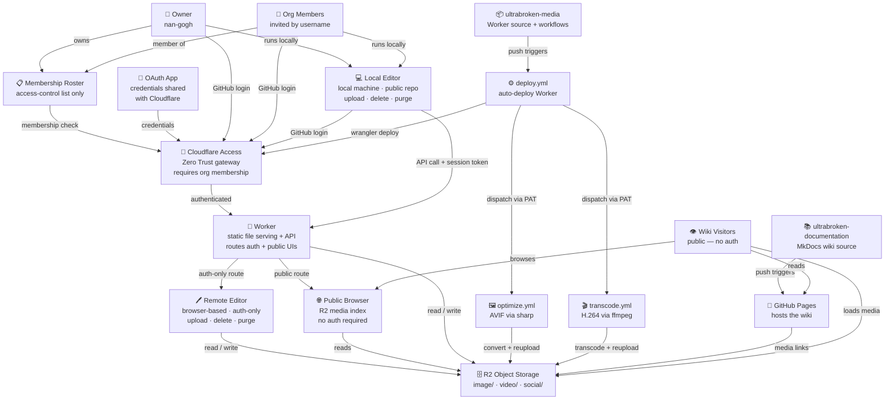

---
title: About the Archives
uid: "WBE"
meta: true
---

# About the Archives

## Community
This site's content is the result of extensive community research, development and curation. All glitches documented here are the product of a phenomenal community glitch hunt and collaborative research effort in The Legend of Zelda: Tears of the Kingdom. Please credit the following volunteer QA communities and contributors, who helped Nintendo Ninjas push several patches, when sharing or referencing material from this site.

## Contribution
If you'd like to document glitches, techniques, setups or builds for the archives, read [this guide](https://github.com/nan-gogh/ultrabroken-documentation/blob/main/README.md), then load [this blank file](https://github.com/nan-gogh/ultrabroken-documentation/tree/main/docs/wiki/_wip) to fill it out and post it [here](https://discord.com/channels/1086729144307564648/1471224902890684557).

## Goal
Concise, community-based documentation for glitches and techniques — readable guides, glitch writeups, and practical how‑tos. We prioritise clear reproduction steps, annotated media, and reproducible setups so readers can verify findings themselves. Entries aim to be useful both for players seeking practical tactics and for researchers analysing systemic behaviour.

## Content
Detailed glitch reports, step‑by‑step instructions and examples; organized into the site's main sections. Each report includes a short summary, the required setup, stepwise reproduction instructions, and analysis of contributing factors. Where useful we attach screenshots, graphics, links to short clips, timing notes, and community-sourced test cases to make verification straightforward.

## Experience
Built with MkDocs + Material for fast search, clear navigation, and readable typesetting on desktop and mobile. The site adapts responsively across devices, supports keyboard navigation and semantic markup for accessibility, and includes lightweight client features to help you find information quickly while testing in-game. We balance a compact layout with readable media so guides remain practical during hands-on verification.

## Discovery
The integrated site search, searchbar- and permalinks as well as AI assisted querying let you find and share related topics quickly. Use the search box to match keywords or filter by section; each page provides stable permalinks for easy sharing. For broader exploration, browse section lists and tags to discover related techniques, investigations, and curated libraries.

## AI Search
When you ask The Librarian, an algorithm searches our archives for documents that match your query and supplies only those matched records to the answer syntesizer. The syntesizer creates a response and assembles searchbar links from involved sources for your single request based solely on the provided records — it does not retain your query nor learn from it or the answer it created. This way we don't trade our archives for the conveniece of AI-assisted navigation features. The accuracy of responses depends mainly the zeal of our Archivists and the quality of their contributions - always verify against the source pages.

## Infrastructure
The archives run on open-source tooling across GitHub and Cloudflare. Media uploads require authentication via the [`ultrabroken-archivists`](https://github.com/ultrabroken-archivists) GitHub organisation — membership is managed by invite only. No personal data is collected; Cloudflare Access verifies org membership through GitHub OAuth and does not store credentials beyond session tokens. Media management is available through a browser-based remote editor and a local machine editor (both require org authentication), alongside a public read-only R2 browser accessible to all visitors.

