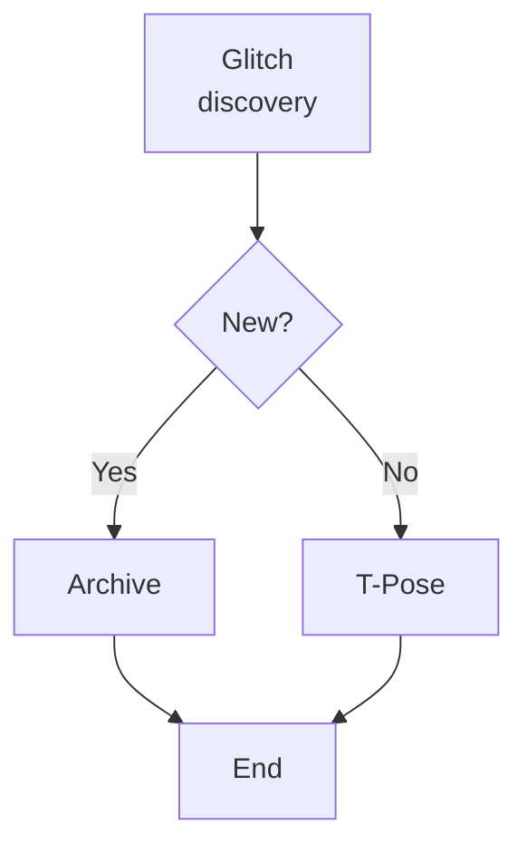
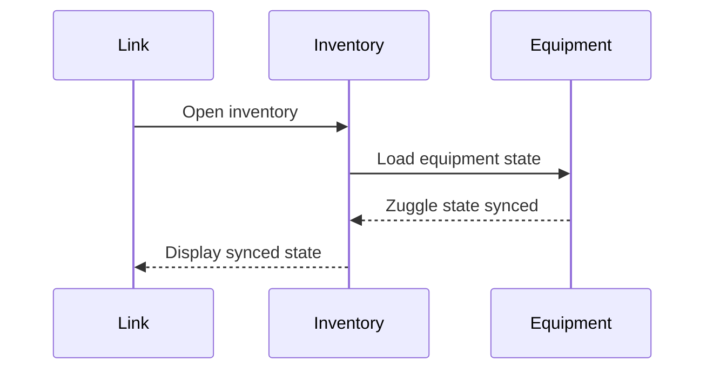
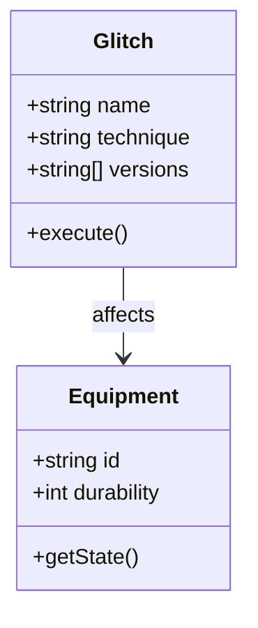
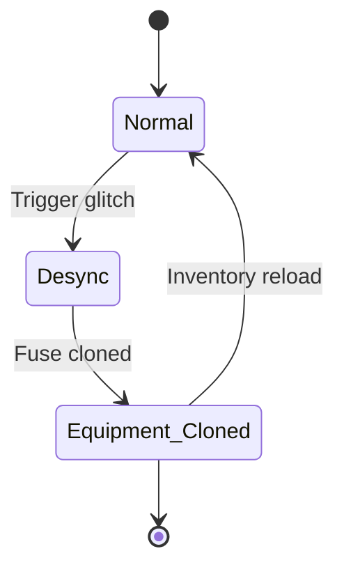
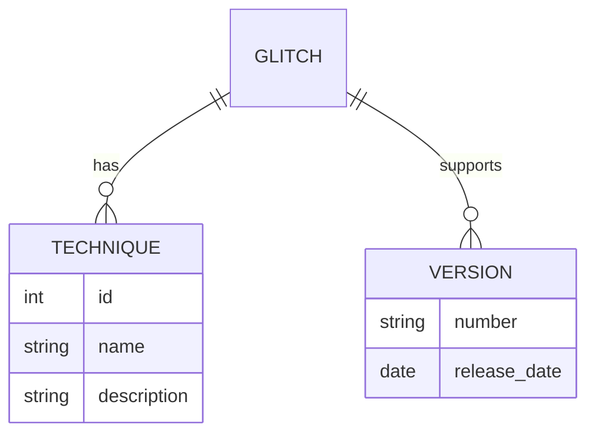
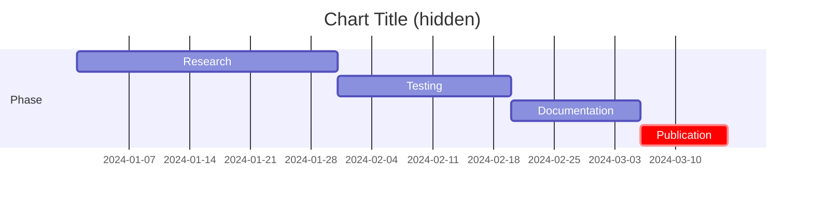
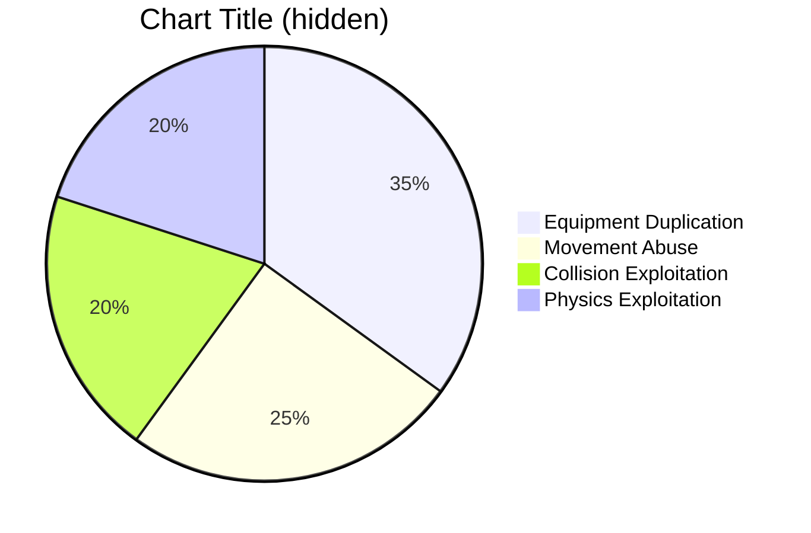
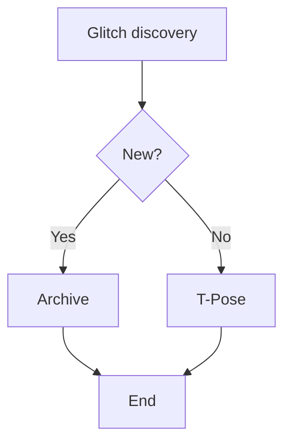

---
title: "Editor Guide & Markdown Reference"
uid: "X01"
unlisted: true
---

# Editor Guide & Markdown Reference

This page provides a comprehensive guide for editors contributing to the Ultrabroken Archives written in Markdown and published with MkDocs + Material. It covers contribution workflows, conventions, custom site features, and all active Markdown extensions.

!!! abstract "Quick Navigation"
    [Contributing](#contributing) · [Frontmatter Reference](#frontmatter-reference) · [Site-Specific Features](#site-specific-features) · [Markdown Reference](#markdown-reference) · [Quick Reference](#quick-reference) · [See Also](#see-also)

## Contributing

This is a community project — everyone is welcome to contribute even without a GitHub account. Join the discussion and post your discoveries in our **[dedicated Encyclopedia thread](https://discord.com/channels/1086729144307564648/1471224902890684557)** on the **[TotK Speedrunning Discord](https://discord.gg/xM8NnTetb2)**.

### Editing Workflow

All wiki content lives in [`docs/wiki/`](https://github.com/nan-gogh/ultrabroken-documentation/tree/main/docs/wiki). Edit Markdown files directly on GitHub or via your normal git workflow.

1. Navigate to the file you want to change, or create a new one in the appropriate subfolder. Use [`_wip/blank.md`](https://github.com/nan-gogh/ultrabroken-documentation/tree/main/docs/wiki/_wip/blank.md) as a starting template.
2. Click the pencil ✏️ icon to edit in the browser, or use your normal GitHub workflow.
3. Make your edits, write a concise commit message, and commit directly to "main" (or open a Pull Request).
4. After committing, the site rebuilds in around two minutes. Wait until it finishes before making the next commit.

**Not ready to publish?** Place your file in [`docs/wiki/_wip/`](https://github.com/nan-gogh/ultrabroken-documentation/tree/main/docs/wiki/_wip) or add `draft: true` to frontmatter — the page builds and gets a shareable URL but stays hidden from search, the grimoire, and web crawlers. See [Drafts & Previews](#drafts--previews) below.

- Use lowercase kebab-case for all filenames.
- Don't append abbreviations or aliases to filenames
- Image files go in [`docs/assets/images/`](https://github.com/nan-gogh/ultrabroken-documentation/tree/main/docs/assets/images).
- To reorganize navigation, update [`mkdocs.yml`](https://github.com/nan-gogh/ultrabroken-documentation/blob/main/mkdocs.yml) or ask a maintainer.
- Avoid editing CI workflows in `.github/workflows/` unless asked.

### Drafts & Previews

Pages can be marked as drafts so they build and deploy to the live site (allowing editors to preview rendered output and share the URL for feedback) while staying completely hidden from all discovery systems.

**A page is treated as a draft when either condition is true:**

- It lives anywhere under the `docs/wiki/_wip/` folder (path-based — no frontmatter needed).
- Its frontmatter contains `draft: true` (flag-based — works in any folder).

#### What drafts are hidden from

| System | Hidden? | How |
|---|---|---|
| Site search | Yes | `search.exclude` metadata injected automatically |
| Grimoire | Yes | BM25 index builder skips draft pages |
| Web crawlers | Yes | `<meta name="robots" content="noindex">` injected |
| Direct URL access | **No** | Pages are accessible — share the link for review |

#### Using `_wip/` (early exploration)

Place your file in `docs/wiki/_wip/`. It will be built and accessible at its URL but invisible to search and the grimoire. No frontmatter flag needed — the path is enough.

The `_wip/blank.md` template already includes `draft: true` by default.

#### Using `draft: true` (near-final drafts)

When a page is close to final and already lives in its real location (e.g., `docs/wiki/glitchcraft/my-new-glitch.md`), add `draft: true` to its frontmatter:

```yaml

title: "My New Glitch"
draft: true

```

When ready to publish, simply remove the `draft: true` line and commit. The page immediately becomes discoverable.

#### Using `unlisted: true` (permanent reference pages)

For pages that are fully published and intentionally permanent — but shouldn't surface in search or AI results (e.g. editor guides, about pages, meta content) — use `unlisted: true`:

```yaml

title: "My Reference Page"
unlisted: true

```

| System | Unlisted? | vs Draft |
|---|---|---|
| Site search | **Searchable** | Draft is excluded |
| AI evidence | Excluded | Same |
| Grimoire | Excluded | Same |
| Web crawlers | **Crawlable** | Draft is noindex |
| Draft banner | **None** | Draft shows banner |
| Social cards / OG | **Generated** | Draft skips |
| Direct URL access | Accessible | Same |

### Style Best Practices

- Write in the present tense and keep instructions concise.
- Keep steps as granular as possible. Extract pausing / unpausing into dedicated steps with **bold** styling.
- **Avoid abbreviations** in titles for easy parsing.
- **Use Admonitions** for important callouts (notes, warnings, tips).
- **Prefer collapsible Details** only when content is optional or supplementary.
- **Leverage code block titles** to label examples.
- **Apply custom IDs** with Attr List for deep-linking to specific sections.
- **Use Def Lists** for glossaries and terminology sections.
- **Tab related content** to keep pages more scannable.
- **Nest extensions** appropriately (e.g., code blocks inside admonitions).

### Cross-Page Linking with `uid:`

Use `uid:` links for all cross-references between wiki pages. Every page is automatically assigned a permanent 3-character identifier (its **UID**) by CI — these never change, even when files are moved or renamed.

#### Syntax

```markdown
[Link Text](uid:XYZ)
[Link Text](uid:XYZ#section-anchor)
```

You can also reference a page by its **filename stem** (without `.md`). CI will automatically resolve it to the permanent UID before the site builds:

```markdown
[Link Text](uid:my-glitch-page)
[Link Text](uid:my-glitch-page#instructions)
```

After CI runs, the source file is updated in-place:

```markdown
[Link Text](uid:A1R)
[Link Text](uid:A1R#instructions)
```

#### Example

```markdown
[About the Archives](uid:WBE)
[AI Search section](uid:WBE#ai-search)
[Zuggle Overload](uid:8QH)
```

#### Why not relative links?

Relative links like `[text](../other-folder/file.md)` break whenever files move between folders. UID links are location-independent — the page's output URL is derived from its UID, not its file path, so links survive any reorganization.

!!! tip "UIDs are automatic"
    The `uid:` field in frontmatter is assigned by CI. Never add or change it manually.


## Frontmatter Reference

Every wiki page begins with YAML frontmatter between `---` delimiter lines. Here are all available fields:

### Frontmatter Fields

The display `title` is required. All other fields are optional but recommended.

#### Syntax 

- `label`: A short abbreviation displayed alongside the title - used for autolinking and search discovery
- `versions`: List of game versions where the technique works — used for filtering and search discovery. Use slash notation (e.g. `"1.3.0/1.4.0"`) for two versions that share identical behaviour.
- `credits`: Names must match [credits.json](../assets/data/credits.json) exactly  - used for autolinking and leaderboard aggregation
- `date`: Discovery or documentation date in `YYYY-MM-DD` format — used for filtering and sorting
- `description`: A brief summary used for search results and SEO - used for search discovery. **Keep under 185 characters** for optimal Discord preview display.
- `tags`: Categorization tags. Auto-indexed into [tags.json](../assets/data/tags.json) - used for filtering and search discovery
- `aliases`: Alternative names for search discovery. Case-insensitive — used for autolinking (see [Glitch Autolinks](#glitch-autolinks))
- `draft`: Set to `true` to mark a page as a draft — hides it from search, grimoire, and web crawlers while keeping it accessible via direct URL (see [Drafts & Previews](#drafts--previews))
- `unlisted`: Set to `true` to exclude a page from AI evidence and the grimoire without marking it as a draft — no banner, no noindex, social cards still generated, and the page remains findable in site search. Use for reference pages or meta content that belongs in the wiki but shouldn't appear in AI or grimoire results.
- `uid`: Auto-generated unique identifier. **Do not add manually.**

#### Example

```yaml

title: "Zuggle Overload"
label: "ZO"
versions: ["1.0.0", "1.1.0", "1.1.1", "1.1.2", "1.2.0", "1.2.1", "1.3.0/1.4.0"]
credits: ["Zvleon", "Mozz"]
date: "2023-05-16"
description: "Zuggling allows you to stack weapons by cloning equipment onto Link."
aliases: ["zuggo", "ZO"]
tags: ["zuggling", "overload"]

```

### Method Metadata

On glitchcraft pages, each method (tab or single-method page) can declare its own version applicability and obsolescence status using a `---`-delimited block inside the page body. This is distinct from the page-level frontmatter — it describes a specific *method*, not the page as a whole.

The hook automatically:

- Appends a version range badge to the tab label and to any collapsible heading (`{ .collapse }`) that wraps the method (e.g. `` `1.2.0+` ``, `` `All versions` ``, `` `1.0.0-1.1.1` ``)
- Inserts inline version badges into the method body
- Injects a `!!! warning "Obsolete Method"` admonition when `obsolete: true`
- Produces a hidden `<div class="ub-method-meta">` consumed by the version filter UI

#### Fields

| Field | Type | Description |
|---|---|---|
| `versions` | list of strings | Game versions this method works on. Use same slash notation as page frontmatter (e.g. `"1.3.0/1.4.0"`). |
| `obsolete` | bool | `true` marks this method as obsolete. Renders a warning admonition and dims the tab label. |

#### Syntax — Tabbed pages (multi-method)

Place the block **inside the tab** at the same 4-space indentation as the tab content, immediately after the tab header:

```markdown
=== "Method 1"
    ---
    versions: ["1.2.0", "1.2.1", "1.3.0/1.4.0", "1.4.1", "1.4.2", "1.4.3", "Switch 2"]
    obsolete: false
    ---
    1. Step one…
```

The tab label (and any enclosing collapsible heading) is rewritten automatically:

```markdown
=== "Method 1 `1.2.0+`"
```

If the version list has a gap (non-contiguous), multiple badges are emitted:

```markdown
=== "Method 1 `1.0.0-1.1.1` `1.2.0+`"
```

#### Syntax — Single-method pages

On pages with no tabs, place the block at the top of the `## Instructions` section (no indentation needed):

```markdown
## Instructions
---
versions: ["1.0.0", "1.1.0", "1.1.1"]
obsolete: true
---
1. Step one…
```

#### Version range badge logic

The badge shown in the tab label and collapsible heading is computed from the `versions` list:

| Condition | Badge shown |
|---|---|
| Single version | `` `1.0.0` `` |
| Covers every version in the catalogue | `` `All versions` `` |
| Contiguous run ending at the current version | `` `1.2.0+` `` (open-ended) |
| Contiguous run not reaching the current version | `` `1.0.0-1.1.1` `` (closed range) |
| Non-contiguous (gap in the list) | `` `1.0.0-1.1.1` `` `` `1.2.0+` `` (one badge per run) |

Platform tags like `"Switch 2"` are excluded from range computation entirely — they are appended as separate badges after the version range badges.

## Site-Specific Features

These are site-specific enhancements beyond standard Markdown.

### Search Links

Links prefixed with `search:` open the site search overlay with the query pre-filled instead of navigating away.

#### Syntax / Example

```markdown
[Slugging](search:Slugging)
```

#### Example

[Slugging](search:Slugging)

### Media Links

Upload, compress and edit images and videos via the [media vault](https://ultrabroken-media.gl1tchcr4vt.workers.dev/manage). Reference them with `media:` prefix.

| Prefix path | Content |
|--|--|
| `media:image/` | Screenshots, graphics (AVIF) |
| `media:video/` | Video clips (H.264+AAC MP4) |

#### Syntax / Example

```markdown

```

#### Example


### Map Embeds

Embed interactive [TotK Object Map](https://objmap-totk.zeldamods.org/) previews using coordinate shorthand.

#### Syntax

`[Label](zoom, x:x_coord, z:z_coord[, layer])`

| Parameter | Required | Description |
|--|-|-|
| zoom | Yes | Initial zoom level (e.g., 8, 10) |
| x:x_coord | Yes | X coordinate (decimals OK) |
| z:z_coord | Yes | Z coordinate (decimals OK) |
| layer | No | Surface, Sky, or Depths (default: Surface) |

??? example "Live Example"

    [Fire Temple VD location](8, x:1321.68, z:-2823.71, Depths)

### YouTube Embeds

Links to YouTube are automatically converted to responsive embedded iframes during the build. No special syntax is required — just use a standard Markdown link pointing to a YouTube URL.

#### Syntax / Example

```markdown
[YouTube](https://youtu.be/VIDEO_ID)

[Crouch Sprinting showcase](https://youtu.be/VIDEO_ID?t=30)
```

**Generic labels** (`YouTube`, `Video`, `Watch`, etc.) render as a bare iframe with no caption. **Descriptive labels** appear as a bold caption above the iframe. Timestamps (`?t=30`) are preserved in the embed. Duplicate video IDs on the same page: all but the first occurrence are dropped.

### Event Viewer Embeds

Embed [TOTK Event Flowcharts](https://restite.org/eventviewer-totk/) as interactive iframes using a compact shorthand syntax.

#### Syntax

`[Label](ev:data[, entry[, version]])`

| Parameter | Position | Required | Description |
|--|--|--|--|
| data | 1 | Yes | JSON filename — `.json` auto-appended |
| entry | 2 | No | Entry point name |
| version | 3 | No | Game version string (default: `EventFlow_v1.2.1`) |

```markdown
[BreakawayFromSage](ev:BreakawayFromSage)

[BreakawayFromSage3 entry](ev:BreakawayFromSage, BreakawayFromSage3)

[BreakawayFromSage3 entry](ev:BreakawayFromSage, BreakawayFromSage3, EventFlow_v1.2.1)
```

**Generic labels** (`event`, `event viewer`, `flowchart`) render as a bare iframe with no caption. **Descriptive labels** appear as a bold caption linking to the full viewer URL.

??? example "Live Example"

    [BreakawayFromSage3](ev:BreakawayFromSage, BreakawayFromSage3)

!!! warning "Heavy Embeds — Use Collapsible Blocks"
    Event viewer embeds are resource-heavy cross-origin iframes. On mobile and lower-end devices, multiple embeds on a single page can cause performance issues or crashes. **Always wrap live embed examples in collapsible details blocks** (as shown above) so they don't load until the user explicitly opens them. On mobile, touch gestures on embeds may prevent page scrolling — this is a known upstream issue with the viewer.

### Social Links and Leaderboard

Credit names in frontmatter are automatically aggregated into the leaderboard. Names will link to social profiles when mapped in [credits.json](https://github.com/nan-gogh/ultrabroken-documentation/blob/main/docs/assets/data/credits.json).

Contributor names are also **automatically hyperlinked in body text** anywhere they appear — so writing "discovered by Mozz" renders as a live link without any manual markup. Names inside code spans or existing links are left untouched.

#### Example

```json
{
    "Mozz": "https://www.youtube.com/@M0zzed"
}
```

**Names must match exactly** — mismatched capitalization or spelling prevents autolinking and splits leaderboard entries.

### Glitch Autolinks

The first mention of any glitch's name, label, or alias in paragraph text is automatically hyperlinked to that glitch's page. This is powered by a glossary built from all published frontmatter.

#### Rules

- Only the **first** occurrence of each glitch name per page is linked.
- A page is never auto-linked to itself — self-mentions stay as plain text.
- Text inside code spans, code blocks, headings, and existing links is never touched.
- Names and aliases match **case-insensitively**. Labels (abbreviations) are **case-sensitive** to avoid false positives on common words.

To mention a glitch without triggering a link, wrap it in a code span (`` `ETS` ``) or an explicit link. To suppress a link entirely, check that the `label` or `aliases` values are not accidentally matching unrelated text.

## Markdown Reference

### Headings

#### Syntax

```markdown
# Heading 1
## Heading 2
### Heading 3
```

#### Example

<h1>Heading 1</h1>
<h2>Heading 2</h2>
<h3>Heading 3</h3>

### Emphasis

#### Syntax

```markdown
**bold text**

*italic text*

`inline code`
```

#### Example

**bold text**

*italic text*

`inline code`

### Lists

**Leave a blank line between regular text and lists and separate unordered lists from ordered lists by headlines!**

#### Syntax

```markdown
##### Unordered List
- Unordered item
- Another item

##### Odered List
1. Ordered item
2. Second item
```

#### Example 

<div markdown="1">

**Unordered List**

- Unordered item
- Another item

**Ordered List**

1. Ordered item
2. Second item

</div>

#### Bad Syntax A

```markdown
Some text
- Unordered item
- Another item
```

#### Bad Example A

Some text
- Unordered item
- Another item

#### Bad Syntax B
```
- Unordered item
- Another item

1. Ordered item
2. Second item
```

#### Bad Exmaple B

- Unordered item
- Another item

1. Ordered item
2. Second item


### Blockquotes

#### Syntax

```markdown
> This is a quote block.
```

#### Example

> This is a quote block.

### Tables

#### Syntax

```markdown
| Column A | Column B |
|-|-|
| Value 1  | Value 2  |
```

#### Example

| Column A | Column B |
|-|-|
| Value 1  | Value 2  |

### Admonition

Displays highlighted blocks for notes, tips, warnings, and other callouts.

#### Syntax

```markdown
!!! note "Optional Title"
    The title is optional. Omit the quoted string to use the type name as title.
```

Aliases: `note`

#### All Types

!!! note "note"
    General information or supplementary context.

!!! abstract "abstract"
    High-level summary or overview. Aliases: `abstract`, `summary`, `tldr`

!!! info "info"
    Factual detail or background. Aliases: `info`, `todo`

!!! tip "tip"
    Helpful suggestion or best practice. Aliases: `tip`, `hint`, `important`

!!! success "success"
    Confirmation or positive outcome. Aliases: `success`, `check`, `done`

!!! question "question"
    Open question or FAQ entry. Aliases: `question`, `help`, `faq`

!!! warning "warning"
    Something to be careful about. Aliases: `warning`, `caution`, `attention`

!!! failure "failure"
    Something that went wrong or is missing. Aliases: `failure`, `fail`, `missing`

!!! danger "danger"
    Critical risk or irreversible action. Aliases: `danger`, `error`

!!! bug "bug"
    Known issue or unexpected behaviour.

!!! example "example"
    Illustrative example or demo.

!!! quote "quote"
    Citation or referenced material. Aliases: `quote`, `cite`

### Details (Collapsible Blocks)

Creates expandable/collapsible sections of content.

#### Syntax

```markdown
??? note "Click to expand"
    Hidden content appears when you click the title.

???+ tip "Expanded by default"
    The + makes it expand automatically on page load.
```

#### Example

??? note "Hidden Content Example"
    This content is collapsed by default. Click the title to expand it.

???+ tip "Expanded by Default"
    Use the `+` prefix to show collapsed blocks expanded initially.

### Superfences (Code Blocks)

Enables advanced code block features including syntax highlighting, line numbers, and custom attributes.

#### Syntax

````markdown
```python
def hello_world():
    print("Hello, World!")
```

```javascript title="filename.js" linenums="1"
console.log("Line numbers and titles work!");
```
````

**Options:** `linenums="1"` for line numbers, `title="name"` for titles, `hl_lines="1 2 3"` to highlight lines.

#### Example

```python title="example.py" linenums="1"
def hello_world():
    print("Hello, World!")
```

### Highlight

Provides syntax highlighting for code blocks. Works transparently with Superfences to color-code code blocks based on language.

#### Syntax

Simply specify the language after the opening triple backticks:

````markdown
```python
print("Highlighted automatically")
```
````

#### Example

```python
print("Highlighted automatically")
```

### InlineHilite

Highlights inline code snippets with syntax coloring.

#### Syntax

```markdown
Use `#!python print("inline")` for inline highlighting.
```

#### Example

Use `#!python print("inline")` for inline highlighting or `#!javascript const x = 42;` for JavaScript.

### Tasklist

Renders interactive checkboxes for task lists.

#### Syntax

```markdown
- [x] Completed task
- [ ] Incomplete task
```

#### Example

- [x] Study Ultrabroken mechanics
- [ ] Master zuggling techniques
- [x] Document discoveries

### TOC (Table of Contents)

Automatically generates a table of contents from headings in the sidebar. Supports custom heading IDs via the Attr List extension.

#### Syntax

```markdown
## My Section {#custom-anchor}

Link to it with [jump to section](#custom-anchor).
```

#### Example

The sidebar navigation on this page is automatically generated from headings.

### Attr List

Adds support for custom attributes (IDs, classes) on elements.

#### Syntax

```markdown
# Heading with Custom ID {#custom-id}

Paragraph with a class.
{: .custom-class }

[Link text](#custom-id){ .button }
```

#### Example

This paragraph has custom styling applied.
{: .md-typeset }

### MD in HTML

Allows Markdown to be written inside HTML blocks.

#### Syntax

```html
<div markdown="1">

**Markdown** inside an HTML div.

- List item 1
- List item 2

</div>
```

#### Example

<div markdown="1">

**Markdown** renders correctly inside HTML containers.

</div>

### Def List (Definition Lists)

Creates structured definition/term pairs useful for glossaries.

#### Syntax

```markdown
Term
:   Definition of the term.

Another Term
:   Another definition.
```

#### Example

Zuggle
:   A glitch technique where Link's equipment state becomes desynchronized with the inventory display.

OOB (Out of Bounds)
:   Exploiting collision detection to move Link outside the intended playable area.

### Tabbed Sections

Creates tabs for organizing related content groups.

#### Syntax

```markdown
=== "Tab 1"

    Content for tab 1.

=== "Tab 2"

    Content for tab 2.
```

#### Example

=== "Method A"

    This is approach A.

=== "Method B"

    This is alternative approach B.

#### Tab Headings

By default, tab labels are not included in the table of contents. Appending `#` marks (2–6) after the closing quote promotes a tab label to a TOC-visible heading at the corresponding level — the same way `#` marks work in regular Markdown headings:

```markdown
=== "Pause-Cancel" ###

    This tab appears as an h3 entry in the TOC.

=== "Menu Overload" ####

    This tab appears as an h4 entry in the TOC.

=== "Basic Method"

    No # marks — this tab does NOT appear in the TOC.
```

The `#` marks are stripped from the rendered tab label — only the text inside the quotes is displayed. A hidden companion heading is injected inside the tab so that the TOC, scroll spy, and deep linking all work automatically. The share icon is placed directly on the tab label instead of on the hidden heading.

Pick the heading level that matches where the tab sits in the page hierarchy. If tabs live directly under an `## Instructions` heading, use `###` (h3) so they nest correctly in the TOC.

| Marks | Heading level | Typical use |
|---|---|---|
| `##` | h2 | Tabs as top-level sections (rare) |
| `###` | h3 | Tabs under an h2 section (most common) |
| `####` | h4 | Tabs under an h3 section |
| `#####` | h5 | Deeply nested tabs |
| `######` | h6 | Maximum depth |

A single `#` or no `#` at all leaves the tab as a plain label with no TOC entry — this is the default behaviour.

When `#` marks are specified, the tab label font size is also scaled to match the chosen heading level — so `###` tabs render at the same size as regular h3 headings, `####` at h4 size, and so on. When no `#` marks are specified (plain tabs), all tab labels render at the same default size regardless of where they appear in the document.

### Collapsible Sections

Any heading can be turned into a clickable toggle that hides or reveals the content beneath it (everything until the next heading of equal or higher level). Use simple shorthand markers at the end of the heading — no need to learn the full Attr List syntax.

#### Syntax

Use `?` to collapse by default, or `!` to expand on load. The marker must be preceded by a space:

```markdown
#### Section Title ?
Content here is hidden by default.

#### Important Section !
Content here is visible on page load.
```

Alternatively, you can write the full Attr List form if preferred:

```markdown
#### Section Title { .collapse }
#### Important Section { .collapse .open }
```

#### Behaviour

- Clicking the heading toggles the section. A chevron icon shows the current state.
- Hash navigation (e.g. clicking a TOC link) automatically expands any collapsed section that contains the target.
- Collapsible sections can be nested — deeper headings inside a collapsed section are hidden along with their content.
- Works with [method metadata](#method-metadata) and version badges.

### Flowchart

Shows decision flows and process steps with nodes and connections.

#### Syntax

````markdown

````

#### Example


### Sequence

Shows interactions between actors or systems over time, useful for documenting workflows and protocols.

#### Syntax

````markdown

````

#### Example


### Class

Illustrates object-oriented structures, classes, and their relationships.

#### Syntax

````markdown

````

#### Example


### State

Represents state transitions and conditional logic for system behavior.

#### Syntax

````markdown

````

#### Example


### ER Diagram

Models database schemas and entity relationships.

#### Syntax

````markdown

````

#### Example


### Gantt

Timeline visualization for project schedules and dependencies. The chart title is automatically hidden.

#### Syntax

````markdown

````

#### Example


### Pie

Displays proportional data distribution. The chart title is automatically hidden.

#### Syntax

````markdown

````

#### Example


### Interactive Viewer

Add the word `viewer` after `mermaid` on the opening fence line — the build system automatically wraps your diagram in an interactive pan-zoom viewer.

#### Syntax

````markdown

````

#### Example



#### Features

- **Scroll wheel**: Zoom in/out toward the cursor
- **Pinch zoom** (mobile): Zoom to the pinch center
- **Slider**: Manually adjust zoom level
- **Drag**: Pan in any direction
- **Reset**: Return to default zoom and center

## Quick Reference

| Extension | Purpose | Key Syntax |
||||
| **Admonition** | Callout blocks | !!! type "Title" |
| **Details** | Collapsible sections | ??? note "Title" |
| **Superfences** | Advanced code blocks |  `python title="..." `  |
| **Highlight** | Syntax coloring | (Automatic with Superfences) |
| **InlineHilite** | Inline code highlighting | `#!python code` |
| **Tasklist** | Interactive checkboxes | - [x] Task |
| **TOC** | Auto table of contents | (Automatic from headings) |
| **Attr List** | Custom attributes | {#id .class} |
| **Md in HTML** | Markdown in HTML blocks | <div markdown="1"> |
| **Def List** | Glossaries | Term\n:   Definition |
| **Tabbed** | Organized content groups | === "Tab Name" |
| **Mermaid** | Diagrams & flowcharts | \`\`\`mermaid graph TD \`\`\` |

## Extension Configuration

All extensions are defined in `mkdocs.yml`:

```yaml
markdown_extensions:
  - admonition
  - pymdownx.details
  - pymdownx.superfences:
      custom_fences:
        - name: mermaid
          class: mermaid
          format: !!python/name:pymdownx.superfences.fence_code_format
  - pymdownx.highlight
  - pymdownx.inlinehilite
  - pymdownx.tasklist:
      clickable_checkbox: true
  - toc:
      permalink: false
  - attr_list
  - md_in_html
  - def_list
  - pymdownx.tabbed:
      alternate_style: true
```

## See Also

- [MkDocs Material Documentation](https://squidfunk.github.io/mkdocs-material/)
- [Python-Markdown Extensions](https://python-markdown.github.io/extensions/)
- [PyMdown Extensions](https://facelessuser.github.io/pymdown-extensions/)
- [Mermaid Theming Documentation](https://mermaid.js.org/config/theming.html)

